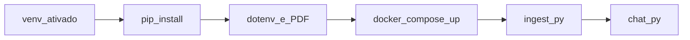

# Desafio MBA Engenharia de Software com IA - Full Cycle

## Pré-requisitos

- Python 3
- Docker com plugin Compose (`docker compose`)
- Conta OpenAI e chave de API (`OPENAI_API_KEY`)

## Configuração do ambiente

Crie e ative um ambiente virtual **antes** de instalar dependências.

```bash
python3 -m venv venv
source venv/bin/activate
```

No Windows (PowerShell ou CMD):

```text
venv\Scripts\activate
```

Com o ambiente ativado, instale as dependências:

```bash
pip install -r requirements.txt
```

### Variáveis de ambiente e PDF

1. Copie o exemplo de ambiente: `cp .env.example .env`
2. Edite `.env` e preencha `OPENAI_API_KEY`.
3. O chat exige também `OPENAI_MODEL` (já há um valor de exemplo em `.env.example`).
4. Coloque o PDF no caminho indicado por `PDF_PATH`. O padrão é `document.pdf` na **raiz do repositório**.

Execute os comandos `python` a seguir na **raiz do repositório**, para que o `.env` seja carregado e caminhos relativos em `PDF_PATH` funcionem corretamente.

## Ordem de execução

1. Subir o banco de dados:

   ```bash
   docker compose up -d
   ```

   Na primeira execução o Postgres pode levar alguns segundos até ficar saudável; o serviço `bootstrap_vector_ext` cria a extensão `vector`. Você pode acompanhar com `docker compose ps`.

2. Executar a ingestão do PDF:

   ```bash
   python src/ingest.py
   ```

3. Rodar o chat:

   ```bash
   python src/chat.py
   ```

O chat pede uma pergunta no terminal e responde com base nos trechos indexados.

## Fluxo resumido


